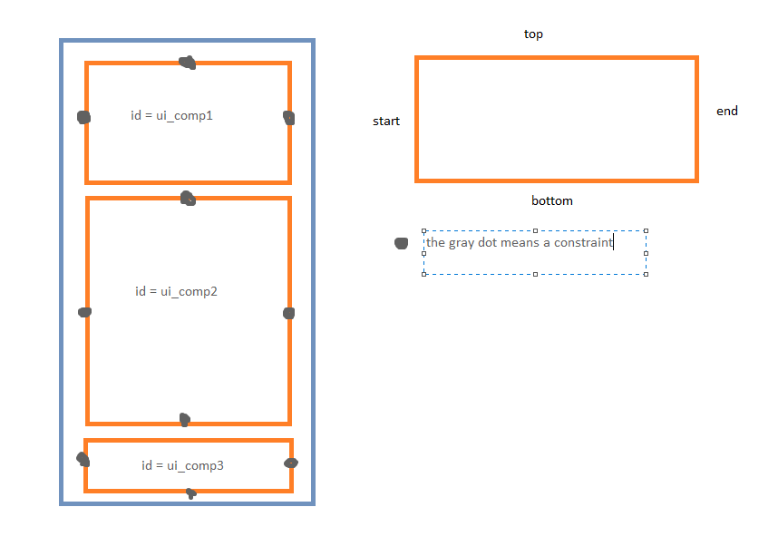

# A quick note on Layout
**OBS! This is a tip and guide to you who had difficulties with placing the content in between the top- and bottom bar - e.g. if the listview has hidden behind the bottom bar or on top of the topbar etc.**

I have experienced that many have had this problem and it is a fairly simple solution to implement - but it is difficult to figure out - so i'll walk through it here with you.

I want to emphasize: **ConstraintLayouts are your best friend** in android app development. ConstrainLayouts are a tool that enables you to very easily implement dynamic and adaptable UI's. Try to see if you can use it as much as possible, without nesting a FrameLayout or LinearLayout that holds the rest of the page's UI components. But ConstraintLayout has a learning curve, so lets break it down here.

First lets break down what kind of constraints there are:

```
app:layout_constraintStart_toStartOf="..."
app:layout_constraintStart_toEndOf="..."

app:layout_constraintEnd_toEndOf="..."
app:layout_constraintEnd_toStartOf="..."

app:layout_constraintTop_toTopOf="..."
app:layout_constraintTop_toBottomOf="..."

app:layout_constraintBottom_toBottomOf="..."
app:layout_constraintBottom_toTopOf="..."
```

*Note that your IDE will often suggest attributes for you if you write a part of the method name, hence you can write 'start_to' and it will suggest app:layout_constraintStart_toStartOf or app:layout_constraintStart_toEndOf for you*.

Now, not all of these are necessary to specify, but you must specify some of them in order to place your UI components in the view.
I want you to image that when you specify a constraint it is like you have a little nail on your component (e.g. at the start of your component) and then you fasten a rubber band to that nail and stretch it to somewhere else, within the limits of the specific components container (e.g. at the start of the parent).
Wheather your component expands or the space between the two nails expands, depends on weather you specify your UI component to be  of heigth/width 0dp, match_parent or wrap_content.
So now, think about the naming of the layout, you are contraining the view to only be shown in this specified area.

Look at the following very beautiful example:



To obstain the result, where
- the ui_comp1 is at the top of the page at all time
- underneath ui_comp1 is ui_comp2, we want the height of ui_comp2 to be dynamic, depending on the size of ui_comp1 and ui_comp3 and the screen size
- ui_comp3 should be at the bottom of the screen at all time

Lets start with ui_comp1 and ui_comp3 because they are only dependent on the containter, hence they only need to be fasten to the parent. Therefore, they would look like (remember comments are not set like this in xml but i think it is easier for you to understand like this):

```
<.../ConstraintLayout 
    ...>

    <View
        android:id="@+id/ui_comp1"
        android:layout_width="match_parent"
        android:layout_height="wrap_content"
        ...
        app:layout_constraintStart_toStartOf="parent" //fasten start of comp to start of parent
        app:layout_constraintEnd_toEndOf="parent"
        app:layout_constraintTop_toTopOf="parent"/> // fasten top of comp to top of parent
        // here we dont specify the top *and* bottom of the component
        // i specify the top because it is important that ui_comp1 is at the top of the page
        // however the height of ui_comp1 depends on the content of it and nothing else 
        // so if i specified the bottom it would mess with the height or the margin of ui_comp1, which i dont want

    ...

    <View
        android:id="@+id/ui_comp3"
        android:layout_width="match_parent"
        android:layout_height="wrap_content"
        ...
        app:layout_constraintStart_toStartOf="parent" //fasten start of comp to start of parent
        app:layout_constraintEnd_toEndOf="parent"
        app:layout_constraintBottom_toBottomOf="parent"/>
        // here again we dont specify the top *and* bottom of the component
        // i specify the bottom because it is important that ui_comp3 is at the bottom of the page
        // again the height of ui_comp3 depends on the content of it and nothing else 
        // ADDITIONALLY, i DO NOT specify that that the top of ui_comp3 should be fasten to the bottom of ui_comp2, because then the placement of ui_comp3 would be dependent on the height of ui_comp2 - which we dont want
        // the height of ui_comp3 should depend on its content and nothing else 

<.../ConstraintLayout 
    .../> // end ConstraintLayout tag
``` 

Now, we have fastened the top and bottom components, which has fixed heights and dynamic widths depending on the width of the parent - now we are only missing ui_comp2. We want ui_comp2 to be inbetween ui_comp1 and ui_comp2, and hence the height to be dependent on these two components. Therefore, we fasten ui_comp2 to ui_comp1 and -3:

```
<.../ConstraintLayout 
    ...>

    ... 

    <View
        android:id="@+id/ui_comp2"
        ...
        app:layout_constraintStart_toStartOf="parent"
        app:layout_constraintEnd_toEndOf="parent"
        app:layout_constraintTop_toBottomOf="@+id/ui_comp1" //fasten the top to bottom of ui_comp1
        app:layout_constraintBottom_toTopOf="@+id/ui_comp3"/> //fasten and end this view and the top of ui_comp3

    ...

<.../ConstraintLayout 
    .../> // end ConstraintLayout tag
```

Now **this does not work**, and that is because we have to specify the height and width even though we are not explicitly asked to do so by the compiler. Hence:

```
<.../ConstraintLayout 
    ...>

    ... 

    <View
        android:id="@+id/ui_comp2"
        android:layout_width="match_parent"
        android:layout_height="0dp" // use 0dp to say 'this component should be flexible and adapt within its given space'/'fill the available space with this view'
        ...
        app:layout_constraintStart_toStartOf="parent"
        app:layout_constraintEnd_toEndOf="parent"
        app:layout_constraintTop_toBottomOf="@+id/ui_comp1" 
        app:layout_constraintBottom_toTopOf="@+id/ui_comp3"/>

    ...

<.../ConstraintLayout 
    .../> // end ConstraintLayout tag
```

What does ConstraintLayout specifically have to do with the included view having overlapping issues with top and bottom bar? Nothing, you could use many other layouts to determine the placement of your components, but **ContraintLayouts are your best friend**, so understand it and use it, god dammit. Hence, of course the example I developed to fix the issue of course invovles using ContraintLayouts.

I hope this helps you a bit - if you have any questions about this, please ask them in the discord chat so that other students can see them too.
